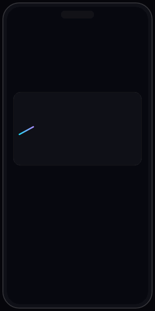
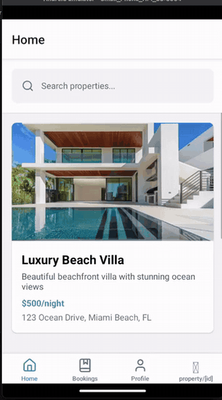
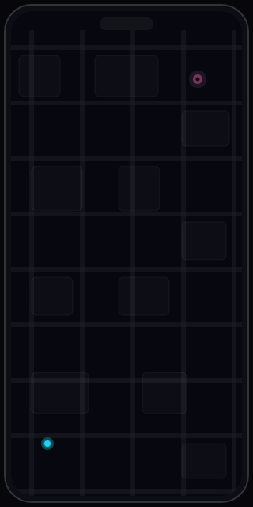

<!-- ============================ HERO BANNER ============================ -->
<div align="center">


<!-- ============================ TYPING EFFECT ============================ -->
<a href="https://github.com/KP-MobileTechie">
  
</a>

<!-- ============================ VISITOR COUNTER + SOCIAL BADGES ============================ -->
<p>
  
  
</p>

<p>
  <a href="https://krunal.vercel.app"></a>
  <a href="https://kp-mobiletechie.vercel.app"></a>
  <a href="https://in.linkedin.com/in/krunal-patel-a0382b1b3"></a>
  <a href="mailto:krunal.frontend@gmail.com"></a>
</p>

</div>

---

## 🧑‍💻 About Me

> **Senior React Native Developer** crafting production-grade mobile experiences for **iOS & Android** — with deep specialization in **fintech, maps & navigation, and scalable mobile architecture**.

- 🚀 **5+ years** building, shipping, and maintaining React Native apps used in production
- 💰 Built **investment platforms** — mutual funds, fixed deposits, SIP journeys, KYC onboarding & secure transactions
- 🗺️ Delivered **maps & navigation features** — Google Maps APIs, route optimization, delivery logistics
- 💳 Integrated **Stripe payments**, **Firebase**, **OneSignal push**, AppsFlyer & analytics pipelines
- 🏗️ Focused on **mobile architecture, performance optimization, and crash reduction** in large codebases
- 🌍 Based in **India** 🇮🇳 · Working with teams worldwide · Gujarati / English / Hindi

```typescript
const krunal: SeniorMobileDeveloper = {
  role: "Senior React Native Developer",
  experience: "5+ years",
  domains: ["Fintech", "Maps & Navigation", "Delivery & Logistics", "Marketplaces"],
  architecture: ["Clean Architecture", "Modular Design", "Offline-First", "CI/CD"],
  currentFocus: "Scalable React Native architecture & advanced TypeScript",
  askMeAbout: ["React Native performance", "Fintech app security", "App Store releases"],
};
```

---

## 💼 Open To Work

<div align="center">

| 🎯 Target Roles | 🌐 Work Mode | 🏢 Company Type |
|:---:|:---:|:---:|
| Senior React Native Developer | Remote (Global) | Product-Based Companies |
| Staff / Lead Mobile Engineer | Contract & Freelance | Fintech & Startups |
| Mobile Architect | Full-Time | International Teams |

📬 **Fastest way to reach me:** [krunal.frontend@gmail.com](mailto:krunal.frontend@gmail.com) · [LinkedIn](https://in.linkedin.com/in/krunal-patel-a0382b1b3)

</div>

---

## 🛠️ Tech Stack

<div align="center">

### 📱 Mobile Core
       

### 🔄 State, Data & APIs
     

### 💳 Integrations & Services
    

### ⚙️ Tooling, CI/CD & Workflow
      

</div>

---

## 🚀 Featured Projects

<table>
<tr>
<td width="33%" align="center">

### 💰 Fintech Investment App


**Professional work** *(closed-source — concept preview)*
Mutual funds, FD & SIP investment journeys, KYC onboarding, secure transactions, Stripe payments.

`React Native` `TypeScript` `Redux Saga` `GraphQL`

</td>
<td width="33%" align="center">

### 🏠 Property Booking App


**[View Repository →](https://github.com/KP-MobileTechie/PropetryBookingApp)**
Airbnb-style booking experience built with Expo Router file-based navigation. Real app demo.

`React Native` `Expo Router` `TypeScript`

</td>
<td width="33%" align="center">

### 🗺️ Delivery Route Optimizer


**Professional work** *(closed-source — concept preview)*
Google Maps integration, live route optimization, ETA tracking for delivery logistics.

`React Native` `Google Maps API` `Geolocation`

</td>
</tr>
</table>

### 📂 More Projects

| Project | Description | Stack |
|---|---|---|
| 🤖 [ai-api-hub](https://github.com/KP-MobileTechie/ai-api-hub) | Live-tested directory of AI & LLM APIs with free tiers highlighted · [Live ↗](https://ai-api-hub.vercel.app) | `Next.js` `TypeScript` |
| 🧭 [glance](https://github.com/KP-MobileTechie/glance) | Local-first browser start page with bento-grid widgets & shareable themes · [Live ↗](https://glance-blush.vercel.app) | `Next.js` `TypeScript` |
| ⌨️ [keyflow](https://github.com/KP-MobileTechie/keyflow) | Terminal-style typing trainer with live WPM & per-key error heatmap · [Live ↗](https://keyflow-rho.vercel.app) | `Next.js` `TypeScript` |
| 🔗 [linkdeck](https://github.com/KP-MobileTechie/linkdeck) | Link-in-bio deck builder · [Live ↗](https://linkdeck-weld.vercel.app) | `Next.js` `TypeScript` |
| 👋 [GestureRating](https://github.com/KP-MobileTechie/GestureRating) | Gesture-driven video rating UI with React Native animations | `React Native` `Reanimated` |
| 💾 [RealMOfflineApp](https://github.com/KP-MobileTechie/RealMOfflineApp) | Offline-first data persistence with Realm DB | `React Native` `Realm` |

---

## 🏆 Professional Highlights

- 💸 Shipped **investment features end-to-end** — mutual funds, fixed deposits & SIP flows handling real money movements
- 🪪 Built **KYC & onboarding systems** — registration, document verification, secure user activation
- 📉 **Reduced crashes & improved performance** in production React Native apps (profiling, refactoring, Hermes)
- 🚚 Implemented **route optimization** for delivery efficiency using Google Maps APIs
- 🔔 Integrated **push notifications (OneSignal)**, deep linking & analytics-driven funnels
- 📹 Early experience with **native Android & WebRTC** video features

---

## 📊 GitHub Statistics

<div align="center">


### 📈 Contribution Graph


### 🏅 GitHub Trophies


</div>

---

## 📚 Currently Learning

- 🧬 **Advanced TypeScript patterns** for large-scale React Native codebases
- ⚡ **New Architecture (Fabric + TurboModules)** & React Native performance internals
- 🧪 **Better mobile testing strategies** — Detox, Maestro, unit & integration coverage
- 🏛️ **Scalable architecture** — modular monorepos, feature isolation, design systems

---

## 📫 Contact

<div align="center">

| | |
|---|---|
| 🌐 **Portfolio** | [krunal.vercel.app](https://krunal.vercel.app) |
| 📱 **Mobile Portfolio** | [kp-mobiletechie.vercel.app](https://kp-mobiletechie.vercel.app) |
| 💼 **LinkedIn** | [linkedin.com/in/krunal-patel-a0382b1b3](https://in.linkedin.com/in/krunal-patel-a0382b1b3) |
| ✉️ **Email** | [krunal.frontend@gmail.com](mailto:krunal.frontend@gmail.com) |
| 🐙 **GitHub** | [@KP-MobileTechie](https://github.com/KP-MobileTechie) |

</div>

---

## 🐍 Contribution Snake

<div align="center">


</div>

---

<!-- ============================ FOOTER ============================ -->
<div align="center">


**⭐ If something here helped you, a star goes a long way!**

*Built with ❤️ in India · React Native Developer · Fintech & Scalable Mobile Solutions*

<sub>Keywords: React Native Developer · Senior Mobile Engineer · TypeScript · JavaScript · Android · iOS · Redux · GraphQL · Firebase · Mobile Architecture · Performance Optimization · CI/CD · Agile · Remote · Fintech</sub>

</div>
