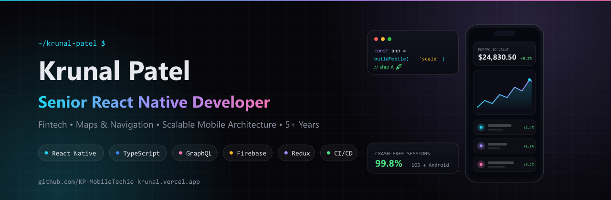
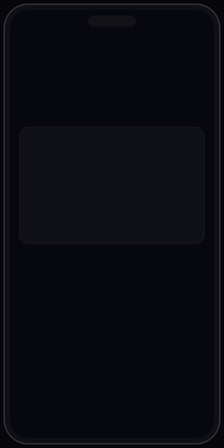
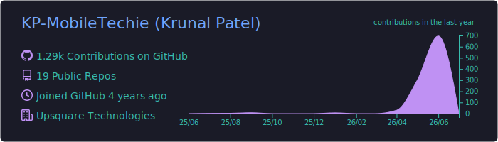
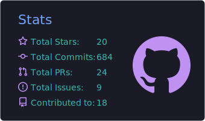
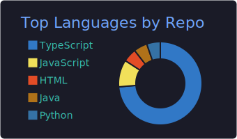
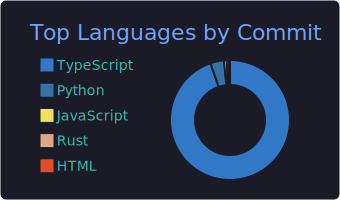
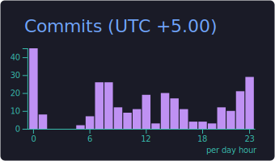
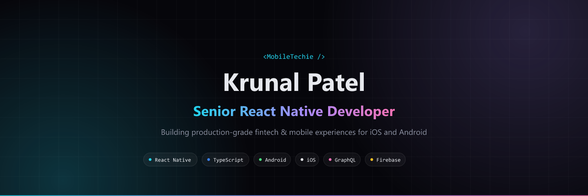

<!-- ============================ HERO BANNER ============================ -->
<div align="center">



<!-- ============================ TYPING EFFECT ============================ -->
<a href="https://github.com/KP-MobileTechie">
  
</a>

<!-- ============================ VISITOR COUNTER + STATUS ============================ -->
<p>
  
  
</p>

<!-- ============================ SOCIAL BADGES ============================ -->
<p>
  <a href="https://krunal.vercel.app"></a>
  <a href="https://kp-mobiletechie.vercel.app"></a>
</p>
<p>
  <a href="https://in.linkedin.com/in/krunal-patel-a0382b1b3"></a>
  <a href="mailto:krunal.frontend@gmail.com"></a>
</p>

</div>

---

## 🧑‍💻 About Me

> **Senior React Native Developer** crafting production-grade mobile experiences for **iOS and Android**, with deep specialization in **fintech, crypto, and scalable mobile architecture**.

- 🚀 **5+ years** building, shipping, and maintaining React Native apps used in production
- 💰 Built **fintech and crypto platforms**: investment journeys, crypto exchange, crypto wallet, KYC onboarding, Stripe payments
- 🏥 Delivered apps across **healthcare, real estate, e-commerce, event management, and safety compliance**
- 🚕 Built **ride hailing and carpooling apps** with Google Maps, live tracking, and route optimization
- 🏗️ Focused on **mobile architecture, performance optimization, and crash reduction** in large codebases
- 🛠️ Open source builder: **CLI tools, npm packages, Zed editor extensions, and Next.js products**
- 🌍 Based in **India** 🇮🇳 · Working with teams worldwide · Gujarati / English / Hindi

```typescript
const krunal: SeniorMobileDeveloper = {
  role: "Senior React Native Developer",
  experience: "5+ years",
  domains: ["Fintech", "Crypto", "Healthcare", "Real Estate", "Ride Hailing", "E-commerce"],
  architecture: ["Clean Architecture", "Modular Design", "Offline-First", "CI/CD"],
  currentFocus: "Scalable React Native architecture and advanced TypeScript",
  askMeAbout: ["React Native performance", "Fintech app security", "App Store releases"],
};
```

---

## 💼 Open To Work

<div align="center">

| 🎯 Target Roles | 🌐 Work Mode | 🏢 Company Type |
|:---:|:---:|:---:|
| Senior React Native Developer | Remote (Global) | Product-Based Companies |
| Staff / Lead Mobile Engineer | Contract & Freelance | Fintech & Startups |
| Mobile Architect | Full-Time | International Teams |

📬 **Fastest way to reach me:** [krunal.frontend@gmail.com](mailto:krunal.frontend@gmail.com) · [LinkedIn](https://in.linkedin.com/in/krunal-patel-a0382b1b3)

</div>

---

## 🛠️ Tech Stack

<div align="center">

**📱 Mobile Core**

       

**🔄 State, Data & APIs**

     

**🌐 Web & Open Source**

    

**💳 Integrations & Services**

    

**⚙️ Tooling, CI/CD & Workflow**

      

</div>

---

## 🚀 Featured Professional Work

<div align="center">

<strong>₿ Crypto Exchange & Wallet</strong>



Real-time trading platform with live markets, candlestick charts, secure wallet, and order management.

   

<br/><br/>

<strong>💰 Fintech Investment Platform</strong>


Mutual funds, fixed deposits and SIP investment journeys with KYC onboarding, secure transactions, and Stripe payments.

   

<br/><br/>

<strong>🚕 Ride Hailing & Carpooling App</strong>


Uber-style taxi and carpooling platform with live driver tracking, route optimization, ETA prediction, and fare management.

   

</div>

### 🏢 More Production Apps I Built

| Domain | What I Built |
|---|---|
| 🏥 **Healthcare** | Patient-facing healthcare app with appointments, records, and secure data handling |
| 🏠 **Real Estate** | Property listing and booking platform with search, filters, and scheduling |
| 🛒 **E-commerce** | Full shopping experience with cart, payments, and order tracking |
| 🎫 **Event Management** | Event discovery, ticketing, and attendee management app |
| 💍 **Matrimony** | Matchmaking platform with profiles, preferences, and secure chat |
| ⛑️ **JHA Safety** | Job Hazard Analysis app for workplace safety compliance and reporting |
| 🚚 **Delivery & Logistics** | Route-optimized delivery apps with live tracking |

*Most professional work is closed source and under NDA. Case studies available on request and on my [portfolio](https://kp-mobiletechie.vercel.app).*

---

## 🌱 Open Source & Side Projects

| Project | Description | Stack |
|---|---|---|
| 🔦 [ctok](https://github.com/ctok-cli/ctok) | CLI that estimates Claude tokens, recommends models, and refines prompts before you send · [Docs ↗](https://ctok-cli.github.io/ctok/) | `TypeScript` `CLI` `npm` |
| 🧩 [ctok-zed](https://github.com/ctok-cli/ctok-zed) | Zed editor extension for ctok token estimation | `Rust` `Zed Extension` |
| 🤖 [ai-api-hub](https://github.com/KP-MobileTechie/ai-api-hub) | Live-tested directory of AI and LLM APIs with free tiers highlighted · [Live ↗](https://ai-api-hub.vercel.app) | `Next.js` `TypeScript` |
| 🧭 [glance](https://github.com/KP-MobileTechie/glance) | Local-first browser start page with bento-grid widgets and shareable themes · [Live ↗](https://glance-blush.vercel.app) | `Next.js` `TypeScript` |
| ⌨️ [keyflow](https://github.com/KP-MobileTechie/keyflow) | Terminal-style typing trainer with live WPM and per-key error heatmap · [Live ↗](https://keyflow-rho.vercel.app) | `Next.js` `TypeScript` |
| 🔗 [linkdeck](https://github.com/KP-MobileTechie/linkdeck) | Link-in-bio deck builder · [Live ↗](https://linkdeck-weld.vercel.app) | `Next.js` `TypeScript` |
| 🎮 [dropfour](https://github.com/KP-MobileTechie/dropfour) | Connect Four game with clean UI · [Live ↗](https://dropfour-eta.vercel.app) | `Next.js` `TypeScript` |
| 📸 Snapfolio | AI case study generator for developer portfolios · [Live ↗](https://snapfolio.vercel.app) | `Next.js` `AI` |
| 🧠 AICareerGrowthPilot | AI-powered career growth platform · *launching soon* | `Next.js` `TypeScript` `AI` |

---

## 🏆 Professional Highlights

- 💸 Shipped **fintech features end-to-end**: mutual funds, fixed deposits and SIP flows handling real money movements
- ₿ Built **crypto exchange and wallet** experiences with real-time market data and secure key handling
- 🪪 Built **KYC and onboarding systems**: registration, document verification, secure user activation
- 📉 **Reduced crashes and improved performance** in production React Native apps (profiling, refactoring, Hermes)
- 🚕 Implemented **live tracking and route optimization** for ride hailing and delivery apps using Google Maps APIs
- 🔔 Integrated **push notifications (OneSignal)**, deep linking, and analytics-driven funnels
- 📦 Published **developer tooling**: CLI tools, npm packages, and a Zed editor extension

---

## 📊 GitHub Analytics

<div align="center">


<br/><br/>









<br/><br/>


</div>

---

## 📚 Currently Learning

- 🧬 **Advanced TypeScript patterns** for large-scale React Native codebases
- ⚡ **New Architecture (Fabric + TurboModules)** and React Native performance internals
- 🧪 **Better mobile testing strategies**: Detox, Maestro, unit and integration coverage
- 🏛️ **Scalable architecture**: modular monorepos, feature isolation, design systems

---

## 📫 Contact

<div align="center">

| | |
|---|---|
| 🌐 **Portfolio** | [krunal.vercel.app](https://krunal.vercel.app) |
| 📱 **Mobile Portfolio** | [kp-mobiletechie.vercel.app](https://kp-mobiletechie.vercel.app) |
| 💼 **LinkedIn** | [Krunal Patel](https://in.linkedin.com/in/krunal-patel-a0382b1b3) |
| ✉️ **Email** | [krunal.frontend@gmail.com](mailto:krunal.frontend@gmail.com) |
| 🐙 **GitHub** | [@KP-MobileTechie](https://github.com/KP-MobileTechie) |

</div>

---

## 🐍 Contribution Snake

<div align="center">


</div>

---

<!-- ============================ FOOTER ============================ -->
<div align="center">



**⭐ If something here helped you, a star goes a long way!**

*Built with ❤️ in India · React Native Developer · Fintech, Crypto & Scalable Mobile Solutions*

<sub>Keywords: React Native Developer · Senior Mobile Engineer · TypeScript · JavaScript · Android · iOS · Redux · GraphQL · Firebase · Mobile Architecture · Performance Optimization · CI/CD · Agile · Remote · Fintech · Crypto</sub>

</div>
